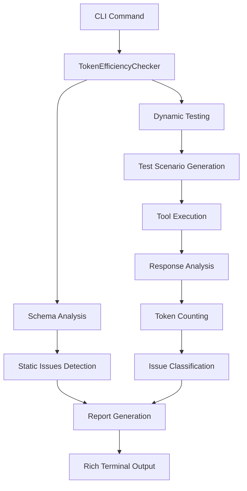

# Token Efficiency Analyzer: Technical Architecture

## Summary

This document provides a deep technical overview of how the Token Efficiency Analyzer works internally, covering data flow, algorithms, performance optimizations, and implementation details.

## Purpose

This guide is intended for developers who want to understand the internal workings of the Token Efficiency Analyzer, contribute to the codebase, or implement similar systems. It covers the complete technical architecture from high-level design patterns to low-level implementation details.

## System Overview



## Core Components

### 1. TokenEfficiencyChecker Class

The main orchestrator that coordinates all token efficiency analysis:

```python
class TokenEfficiencyChecker:
    def __init__(self):
        self.max_recommended_tokens = 25000  # Anthropic's guideline
        self.sample_requests_per_tool = 3    # Test scenarios per tool
        
        # Detection patterns
        self.verbose_id_patterns = [...]     # UUID, hash patterns
        self.pagination_params = [...]       # Pagination indicators
        self.filtering_params = [...]        # Filtering indicators
```

**Key Responsibilities:**
- Coordinate static and dynamic analysis
- Manage test scenario generation
- Collect and analyze metrics
- Generate actionable recommendations

### 2. Analysis Pipeline

#### Phase 1: Static Schema Analysis
```python
async def analyze_token_efficiency(self, tools, mcp_client):
    for tool in tools:
        # Static analysis (no tool execution)
        static_issues = self._analyze_tool_schema(tool)
        
        # Dynamic analysis (actual tool calls)
        metrics = await self._measure_response_sizes(tool, mcp_client)
        dynamic_issues = self._analyze_response_metrics(metrics)
```

#### Phase 2: Dynamic Testing
```python
async def _measure_response_sizes(self, tool, mcp_client):
    # Generate 3 test scenarios
    scenarios = self._generate_test_scenarios(tool)
    
    for scenario in scenarios:
        # Execute actual tool call
        response = await mcp_client.call_tool(tool.name, scenario.params)
        
        # Measure and analyze
        token_count = self._estimate_token_count(response)
        # ... collect metrics
```

## Algorithm Details

### Test Scenario Generation Algorithm

```python
def _generate_test_scenarios(self, tool) -> List[EvaluationScenario]:
    """
    Generates exactly 3 scenarios for comprehensive testing:
    1. Minimal - required params only
    2. Typical - required + common optional params  
    3. Large - required + params that might cause oversized responses
    """
    
    scenarios = []
    schema = tool.input_schema
    properties = schema.get("properties", {})
    required = schema.get("required", [])
    
    # Scenario 1: Minimal
    minimal_params = {}
    for param in required:
        minimal_params[param] = self._generate_sample_value(param, properties[param])
    
    # Scenario 2: Typical (add small pagination)
    typical_params = minimal_params.copy()
    for pagination_param in self.pagination_params:
        if pagination_param in properties:
            if pagination_param in ["limit", "count", "per_page"]:
                typical_params[pagination_param] = 10  # Small limit
            break
    
    # Scenario 3: Large (add large pagination)
    large_params = minimal_params.copy()
    for pagination_param in self.pagination_params:
        if pagination_param in properties:
            if pagination_param in ["limit", "count", "per_page"]:
                large_params[pagination_param] = 1000  # Large limit
            break
    
    return [
        EvaluationScenario("minimal", minimal_params, "Required params only"),
        EvaluationScenario("typical", typical_params, "Normal usage"),
        EvaluationScenario("large", large_params, "Test size limits")
    ]
```

### Smart Value Generation Algorithm

```python
def _generate_sample_value(self, param_name: str, param_schema: Dict) -> Any:
    """
    Context-aware value generation based on parameter semantics
    """
    param_type = param_schema.get("type", "string")
    param_lower = param_name.lower()
    
    if param_type == "string":
        # Pattern matching for semantic value generation
        semantic_patterns = {
            ["url", "link", "href"]: "https://example.com",
            ["email", "mail"]: "test@example.com", 
            ["query", "search", "term"]: "sample query",
            ["id", "key"]: "sample_id",
        }
        
        for patterns, value in semantic_patterns.items():
            if any(pattern in param_lower for pattern in patterns):
                return value
        
        return "sample_value"  # Generic fallback
    
    elif param_type == "integer":
        # Special handling for pagination parameters
        if param_lower in ["limit", "count", "per_page"]:
            return 10  # Will be overridden by scenario logic
        return 1
    
    # ... handle other types
```

### Token Counting Algorithm

```python
def _estimate_token_count(self, response: Any) -> int:
    """
    Approximate token counting using character-based estimation
    """
    if response is None:
        return 0
    
    # Serialize to JSON string
    try:
        response_text = json.dumps(response, ensure_ascii=False)
    except (TypeError, ValueError):
        response_text = str(response)
    
    # Rough approximation: 1 token ≈ 4 characters
    # This is conservative; actual tokenization varies by model
    estimated_tokens = len(response_text) // 4
    
    return max(1, estimated_tokens)
```

## Issue Detection Algorithms

### 1. Oversized Response Detection

```python
def _analyze_response_metrics(self, metrics: ResponseMetrics) -> List[TokenEfficiencyIssue]:
    issues = []
    
    for measurement in metrics.measurements:
        if measurement.token_count > self.max_recommended_tokens:
            issues.append(TokenEfficiencyIssue(
                tool_name=metrics.tool_name,
                issue_type=IssueType.OVERSIZED_RESPONSE,
                severity=Severity.WARNING,
                message=f"Response contains {measurement.token_count:,} tokens (>{self.max_recommended_tokens:,} recommended)",
                suggestion="Consider implementing pagination, filtering, or truncation",
                measured_tokens=measurement.token_count
            ))
```

### 2. Pagination Support Detection

```python
def _check_pagination_support(self, tool) -> List[TokenEfficiencyIssue]:
    input_schema = tool.input_schema
    properties = input_schema.get("properties", {})
    
    # Check for pagination parameter presence
    has_pagination = any(
        param_name.lower() in [p.lower() for p in self.pagination_params]
        for param_name in properties.keys()
    )
    
    # Check if tool likely returns collections
    if not has_pagination and self._likely_returns_collections(tool):
        return [TokenEfficiencyIssue(
            tool_name=tool.name,
            issue_type=IssueType.NO_PAGINATION,
            severity=Severity.INFO,
            message="Tool likely returns collections but doesn't support pagination",
            suggestion="Consider adding pagination parameters (limit, offset, page)"
        )]
```

### 3. Verbose Identifier Detection

```python
def _detect_verbose_identifiers(self, response: Any) -> bool:
    """
    Detect technical identifiers that could be simplified
    """
    if not isinstance(response, (dict, list)):
        return False
    
    response_str = json.dumps(response)
    
    # Regex patterns for verbose identifiers
    verbose_patterns = [
        r'[0-9a-f]{8}-[0-9a-f]{4}-[0-9a-f]{4}-[0-9a-f]{4}-[0-9a-f]{12}',  # UUID
        r'[0-9a-f]{32}',  # MD5-like
        r'[0-9a-f]{40}',  # SHA1-like  
        r'[A-Za-z0-9]{20,}',  # Long alphanumeric
    ]
    
    return any(re.search(pattern, response_str) for pattern in verbose_patterns)
```

## Performance Optimizations

### 1. Concurrent Tool Execution

```python
async def analyze_token_efficiency(self, tools, mcp_client):
    # Process tools concurrently for better performance
    semaphore = asyncio.Semaphore(3)  # Limit concurrent requests
    
    async def analyze_single_tool(tool):
        async with semaphore:
            return await self._measure_response_sizes(tool, mcp_client)
    
    # Execute all tools concurrently
    tasks = [analyze_single_tool(tool) for tool in tools]
    results = await asyncio.gather(*tasks, return_exceptions=True)
```

### 2. Efficient Token Counting

The token counting algorithm uses character-based approximation rather than actual tokenization for speed:

- **Pros**: Fast, no external dependencies, consistent across models
- **Cons**: Approximate (but conservative estimate)
- **Accuracy**: Within ~20% of actual token counts for typical JSON responses

### 3. Smart Error Handling

```python
async def _measure_response_sizes(self, tool, mcp_client):
    measurements = []
    
    for scenario in scenarios:
        try:
            response = await mcp_client.call_tool(tool.name, scenario.params)
            # ... process successful response
        except Exception as e:
            # Record error but continue with other scenarios
            measurements.append(ResponseMetric(
                scenario=scenario.name,
                error=str(e),
                token_count=0
            ))
            logger.warning(f"Tool {tool.name} failed scenario {scenario.name}: {e}")
    
    # Continue analysis even if some scenarios fail
    return ResponseMetrics(tool.name, measurements, ...)
```

## Data Structures

### Core Data Models

```python
@dataclass
class EvaluationScenario:
    """Test scenario for tool execution"""
    name: str                    # "minimal", "typical", "large"
    params: Dict[str, Any]      # Generated parameters
    description: str            # Human-readable description

@dataclass  
class ResponseMetric:
    """Metrics for a single tool response"""
    scenario: str               # Which scenario was tested
    token_count: int           # Estimated tokens in response
    response_time: float       # Execution time in seconds
    response_size_bytes: int   # Raw response size
    contains_low_value_data: bool    # Has redundant data
    has_verbose_identifiers: bool    # Has technical IDs
    error: Optional[str] = None      # Error message if failed

@dataclass
class ResponseMetrics:
    """Aggregated metrics for a tool"""
    tool_name: str
    measurements: List[ResponseMetric]
    avg_tokens: float          # Average across scenarios
    max_tokens: int           # Largest response
    min_tokens: int           # Smallest response
```

## Extension Points

The architecture is designed for extensibility:

### 1. Custom Issue Types

```python
class IssueType(str, Enum):
    # Existing types
    OVERSIZED_RESPONSE = "oversized_response"
    NO_PAGINATION = "no_pagination"
    
    # Add new types here
    CUSTOM_ISSUE = "custom_issue"
```

### 2. Custom Value Generators

```python
def _generate_sample_value(self, param_name: str, param_schema: Dict) -> Any:
    # Add custom value generation logic
    if param_name.lower() == "custom_param":
        return generate_custom_value()
    
    # Fall back to default logic
    return super()._generate_sample_value(param_name, param_schema)
```

### 3. Custom Metrics

```python
@dataclass
class ExtendedResponseMetric(ResponseMetric):
    """Extended metrics with custom fields"""
    custom_metric: float = 0.0
    another_metric: str = ""
```

## Configuration

Key configuration parameters:

```python
class TokenEfficiencyChecker:
    def __init__(self):
        # Token limits (based on Anthropic guidelines)
        self.max_recommended_tokens = 25000
        
        # Test scenarios
        self.sample_requests_per_tool = 3
        
        # Detection patterns (customizable)
        self.pagination_params = [
            "limit", "offset", "page", "page_size", "per_page",
            "cursor", "next_token", "continuation_token"
        ]
        
        self.filtering_params = [
            "filter", "where", "query", "search", "include", "exclude",
            "fields", "select", "only", "except", "type", "status"
        ]
```

## Error Handling Strategy

The system uses graceful degradation:

1. **Tool Execution Errors**: Continue with other scenarios
2. **Schema Parsing Errors**: Skip problematic tools, log warnings  
3. **Network Errors**: Retry with exponential backoff
4. **Response Analysis Errors**: Record partial metrics

This ensures the analysis completes even when individual tools have issues.

## See Also

- **[Documentation Index](./README.md)** - Complete MCP Doctor documentation overview
- **[Token Efficiency Arguments](./token-efficiency-arguments.md)** - How MCP Doctor generates test arguments
- **[Token Efficiency Troubleshooting](./troubleshooting-token-efficiency.md)** - Solutions for common issues

---

This architecture enables MCP Doctor to provide comprehensive token efficiency analysis while maintaining high performance and reliability across diverse MCP server implementations.
