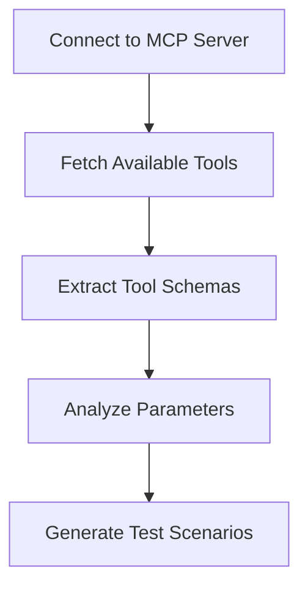

# Token Efficiency Analyzer: Argument Generation

## Summary

This document explains how MCP Doctor's Token Efficiency Analyzer automatically generates arguments for testing MCP tools without requiring manual configuration.

## Purpose

When running `mcp-doctor analyze --check token_efficiency`, users often wonder where the test arguments come from. This guide provides a comprehensive explanation of the automatic argument generation system, including the algorithms, patterns, and design decisions that enable universal compatibility with any MCP server.

## Overview

When you run `mcp-doctor analyze --target "npx your-mcp-server" --check token_efficiency`, MCP Doctor doesn't use hardcoded arguments. Instead, it intelligently generates realistic test arguments based on each tool's schema to measure actual token usage and response efficiency.

## How It Works

### 1. Schema Discovery Phase



First, MCP Doctor connects to your MCP server and discovers all available tools using the MCP protocol's `tools/list` method. Each tool provides its schema including:

- **Required parameters** - Must be provided for the tool to work
- **Optional parameters** - Can be provided to modify behavior
- **Parameter types** - string, integer, boolean, array, object
- **Parameter descriptions** - Help understand the parameter's purpose

### 2. Test Scenario Generation

For each tool, the Token Efficiency Analyzer generates **3 different test scenarios**:

#### 🔹 **Scenario 1: "minimal"**
- Uses **only required parameters**
- Tests the tool's baseline response size
- Ensures the tool works with minimum input

#### 🔹 **Scenario 2: "typical"**
- Uses required parameters + common optional parameters
- Adds small pagination limits (e.g., `limit: 10`) if available
- Simulates normal usage patterns

#### 🔹 **Scenario 3: "large"**
- Uses required parameters + larger optional values
- Sets pagination to larger values (e.g., `limit: 1000`)
- Tests for potentially oversized responses

### 3. Smart Value Generation

The `_generate_sample_value()` method creates contextually appropriate values based on parameter names and types:

```python
def _generate_sample_value(self, param_name: str, param_schema: Dict[str, Any]) -> Any:
    param_type = param_schema.get("type", "string")
    
    if param_type == "string":
        param_lower = param_name.lower()
        
        # URL parameters
        if any(word in param_lower for word in ["url", "link", "href"]):
            return "https://example.com"
        
        # Email parameters
        elif any(word in param_lower for word in ["email", "mail"]):
            return "test@example.com"
        
        # Search/query parameters
        elif any(word in param_lower for word in ["query", "search", "term"]):
            return "sample query"
        
        # ID parameters
        elif any(word in param_lower for word in ["id", "key"]):
            return "sample_id"
        
        # Generic string
        else:
            return "sample_value"
    
    elif param_type == "integer":
        return 1
    elif param_type == "boolean":
        return True
    # ... and so on
```

## Real-World Examples

### Example 1: Web Scraping Tool

**Tool Schema:**
```json
{
  "name": "scrape_url",
  "description": "Scrape content from a web page",
  "parameters": {
    "properties": {
      "url": {
        "type": "string", 
        "description": "URL to scrape"
      },
      "limit": {
        "type": "integer", 
        "description": "Maximum content length"
      },
      "include_images": {
        "type": "boolean",
        "description": "Whether to include images"
      }
    },
    "required": ["url"]
  }
}
```

**Generated Test Calls:**

1. **Minimal Scenario:**
   ```json
   {"url": "https://example.com"}
   ```

2. **Typical Scenario:**
   ```json
   {
     "url": "https://example.com",
     "limit": 10
   }
   ```

3. **Large Scenario:**
   ```json
   {
     "url": "https://example.com", 
     "limit": 1000
   }
   ```

### Example 2: Database Query Tool

**Tool Schema:**
```json
{
  "name": "search_users",
  "description": "Search for users in the database",
  "parameters": {
    "properties": {
      "query": {
        "type": "string",
        "description": "Search query"
      },
      "page": {
        "type": "integer", 
        "description": "Page number"
      },
      "per_page": {
        "type": "integer",
        "description": "Results per page"
      }
    },
    "required": ["query"]
  }
}
```

**Generated Test Calls:**

1. **Minimal Scenario:**
   ```json
   {"query": "sample query"}
   ```

2. **Typical Scenario:**
   ```json
   {
     "query": "sample query",
     "page": 1,
     "per_page": 10
   }
   ```

3. **Large Scenario:**
   ```json
   {
     "query": "sample query",
     "page": 1, 
     "per_page": 1000
   }
   ```

## Parameter Recognition Patterns

The argument generator recognizes common parameter patterns:

| Parameter Pattern | Generated Value | Examples |
|------------------|----------------|----------|
| `url`, `link`, `href` | `"https://example.com"` | `url`, `website_link`, `href_target` |
| `email`, `mail` | `"test@example.com"` | `email`, `user_email`, `mail_address` |
| `query`, `search`, `term` | `"sample query"` | `search_query`, `query`, `search_term` |
| `id`, `key` | `"sample_id"` | `user_id`, `api_key`, `record_id` |
| `limit`, `count`, `per_page` | `10` (typical), `1000` (large) | `limit`, `max_count`, `per_page` |
| `page`, `offset` | `1` | `page`, `page_number`, `offset` |
| Generic string | `"sample_value"` | `name`, `description`, `content` |
| Integer | `1` | `timeout`, `retries`, `priority` |
| Boolean | `true` | `enabled`, `include_metadata`, `verbose` |
| Array | `[]` | `tags`, `categories`, `filters` |
| Object | `{}` | `metadata`, `options`, `config` |

## Pagination Detection

The analyzer automatically detects pagination parameters and adjusts them for different scenarios:

**Pagination Parameters:**
- `limit`, `count`, `per_page`, `page_size` → Set to `10` (typical), `1000` (large)
- `page`, `page_number` → Set to `1`
- `offset` → Set to `0`
- `cursor`, `next_token`, `continuation_token` → Set to `null`

## Benefits of This Approach

### ✅ **Universal Compatibility**
- Works with **any MCP server** without manual configuration
- No need to write custom test cases for each tool
- Automatically adapts to new tools and parameters

### ✅ **Realistic Testing**
- Generates contextually appropriate values
- Tests multiple usage patterns (minimal, typical, large)
- Simulates real-world agent behavior

### ✅ **Comprehensive Coverage**
- Tests all tools in the server
- Covers both required and optional parameters
- Identifies tools that might return oversized responses

### ✅ **Follows Anthropic Guidelines**
- Implements "evaluation-driven development" approach
- Measures actual token usage vs. theoretical limits
- Provides actionable optimization recommendations

## Configuration Options

### Customizing Test Scenarios

You can influence the argument generation by understanding how the analyzer works:

1. **Parameter Naming**: Use descriptive parameter names that match the recognition patterns
2. **Schema Descriptions**: Provide clear parameter descriptions (though not used for value generation)
3. **Required vs Optional**: Mark parameters as required only if they're truly necessary

### Example: Well-Designed Tool Schema

```json
{
  "name": "search_documents",
  "description": "Search through document database with pagination",
  "parameters": {
    "properties": {
      "search_query": {
        "type": "string",
        "description": "Text to search for in documents"
      },
      "limit": {
        "type": "integer", 
        "description": "Maximum number of results (1-1000)",
        "minimum": 1,
        "maximum": 1000
      },
      "include_content": {
        "type": "boolean",
        "description": "Whether to include full document content"
      }
    },
    "required": ["search_query"]
  }
}
```

This schema will generate optimal test arguments because:
- `search_query` → `"sample query"` (recognized pattern)
- `limit` → `10` (typical), `1000` (large) (pagination parameter)
- `include_content` → `true` (boolean default)

## Troubleshooting

### Common Issues

**❌ Tool execution fails with generated arguments**
- Check that your tool handles the generated sample values gracefully
- Ensure required parameters are properly marked in the schema
- Verify your tool doesn't have hidden dependencies on specific argument formats

**❌ Arguments seem inappropriate for your tool**
- Consider renaming parameters to match recognition patterns
- Use more descriptive parameter names
- Check that parameter types are correctly specified

**❌ Token efficiency analysis shows no results**
- Verify your MCP server supports the `tools/call` method
- Check that tools return actual data (not just success messages)
- Ensure the MCP server is accessible and responding

### Debugging Argument Generation

To see exactly what arguments are being generated, run with verbose mode:

```bash
mcp-doctor analyze --target "npx your-mcp-server" --check token_efficiency --verbose
```

This will show:
- Which tools are being tested
- What arguments are generated for each scenario
- Actual tool responses and token counts
- Any errors during tool execution

## Implementation Details

The argument generation happens in these key methods:

1. **`_generate_test_scenarios()`** - Creates the 3 test scenarios
2. **`_generate_sample_value()`** - Generates individual parameter values
3. **`_measure_response_sizes()`** - Executes tools with generated arguments
4. **`_analyze_response_metrics()`** - Analyzes the results for efficiency issues

The complete flow ensures that every tool is tested comprehensively while maintaining compatibility across different MCP server implementations.

## See Also

- **[Documentation Index](./README.md)** - Complete MCP Doctor documentation overview
- **[Technical Architecture](./token-efficiency-architecture.md)** - Deep dive into implementation details and algorithms  
- **[Token Efficiency Troubleshooting](./troubleshooting-token-efficiency.md)** - Solutions for common issues

---

This automatic argument generation is what makes MCP Doctor's Token Efficiency Analyzer unique - it provides deep behavioral analysis without requiring any manual configuration or test case writing.
